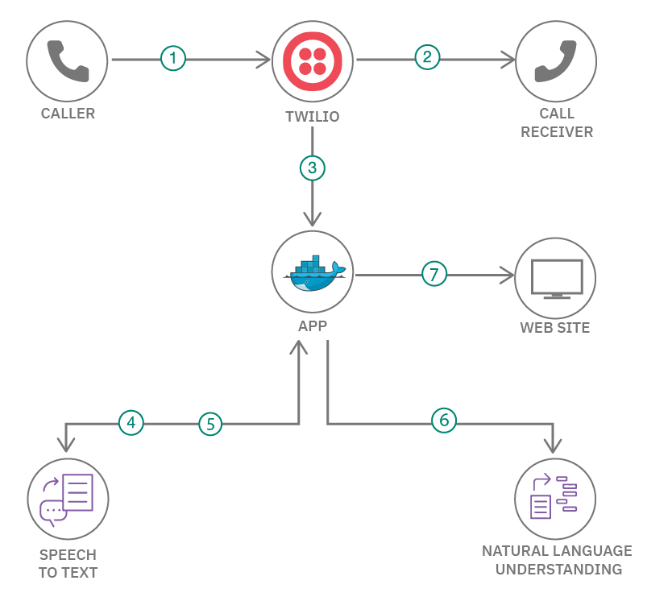

**TEMPORARY LOCATION:** Once published, this repository will be moved to github.com/IBM

---

# Transcribe a phone call in real-time

In this code pattern, we will transcribe and analyze what is said on a phone call using IBM Watson Speech to Text, IBM Watson Natural Language Understanding and Twilio.

When you have completed this code pattern, you will understand how to:

* use IBM Watson Speech to Text to transcribe audio in real-time



## Flow

1. One person should make a phone call
    - We'll call this person "the caller".
    - They call a phone number managed by Twilio.
2. Twilio routes the phone call to another person
    - We'll call this person "the receiver".
    - They should answer the phone call.

The caller and receiver can start talking to each other.
While they are doing this...

3. Twilio streams a copy of the audio from the phone call to your application
4. Your application sends audio to the Speech to Text service for transcribing
5. The Speech to Text service asynchronously calls the app with transcriptions when they are available
6. The app submits the transcription text to Natural Language Understanding for analysis
7. The transcriptions and analyses can be monitored from a web page

---

## Watch the Video

TODO : RECORD DEMO VIDEO

---

## Steps

Set the following environment variables in your shell for use in the commands below
```sh
CODE_ENGINE_PROJECT_NAME=voice-agent-copilot
CODE_ENGINE_APP_NAME=phone-stt-demo
IBM_CLOUD_REGION=eu-gb
```

1. [Log into IBM Cloud](#1-log-into-ibm-cloud)
2. [Create a project in IBM Code Engine](#2-create-ibm-code-engine-project)
3. [Create an API key for the Watson services used in this project](#3-create-ibm-watson-credentials)
4. [Clone the source code](#4-clone-the-repo)
5. [Build the application image](#5-build-the-application-image)
6. [Push the application image to a container registry](#6-push-the-application-image-to-a-container-registry)
7. [Create a pull secret for the image](#7-create-a-pull-secret-for-the-application-image)
8. [Deploy the application](#8-deploy-the-application)
9. [Configure Twilio to use your application](#9-point-a-twilio-phone-number-at-your-deployed-application)


### 1. Log into IBM Cloud

Log in to the desired account with the IBM Cloud CLI using `ibmcloud login`

### 2. Create IBM Code Engine project

The quickest way to get up and running is to use the [IBM Cloud CLI with the Code Engine plugin](https://cloud.ibm.com/docs/codeengine?topic=codeengine-cli).

If you do not have a Code Engine project, create one
```sh
ibmcloud ce project create --name $CODE_ENGINE_PROJECT_NAME
```

Target the project
```sh
ibmcloud ce project target --name $CODE_ENGINE_PROJECT_NAME
```

### 3. Create IBM Watson credentials

#### 3.1 Speech to Text

Create an instance of the IBM Watson Speech to Text service
```sh
ibmcloud resource service-instance-create \
    phone-stt-demo-speech-to-text \
    speech-to-text \
    lite \
    $IBM_CLOUD_REGION
```

Create an API key for your Speech to Text instance
```sh
ibmcloud resource service-key-create \
    code-engine-stt-credentials \
    Manager \
    --instance-name phone-stt-demo-speech-to-text
```

Extract the API key and instance URL into environment variables
```sh
STT_API_KEY=$(ibmcloud resource service-key code-engine-stt-credentials  --output json | jq -r ".[0].credentials.apikey")
STT_INSTANCE_URL=$(ibmcloud resource service-key code-engine-stt-credentials  --output json | jq -r ".[0].credentials.url")

echo "Speech to Text : API key : $STT_API_KEY"
echo "Speech to Text : URL     : $STT_INSTANCE_URL"
```

Create a Secret with the API key and instance URL
```sh
ibmcloud ce secret create \
    --name phone-demo-apikey-stt \
    --from-literal STT_API_KEY=$STT_API_KEY \
    --from-literal STT_INSTANCE_URL=$STT_INSTANCE_URL
```

#### 3.2 Natural Language Understanding

Create an instance of the IBM Watson Natural Language Understanding service
```sh
ibmcloud resource service-instance-create \
    phone-stt-demo-natural-language-understanding \
    natural-language-understanding \
    free \
    $IBM_CLOUD_REGION
```

Create an API key for your Natural Language Understanding instance
```sh
ibmcloud resource service-key-create \
    code-engine-nlu-credentials \
    Manager \
    --instance-name phone-stt-demo-natural-language-understanding
```

Extract the API key and instance URL into environment variables
```sh
NLU_API_KEY=$(ibmcloud resource service-key code-engine-nlu-credentials  --output json | jq -r ".[0].credentials.apikey")
NLU_INSTANCE_URL=$(ibmcloud resource service-key code-engine-nlu-credentials  --output json | jq -r ".[0].credentials.url")

echo "Natural Language Understanding : API key : $NLU_API_KEY"
echo "Natural Language Understanding : URL     : $NLU_INSTANCE_URL"
```

Create a Secret with the API key and instance URL
```sh
ibmcloud ce secret create \
    --name phone-demo-apikey-nlu  \
    --from-literal NLU_API_KEY=$NLU_API_KEY \
    --from-literal NLU_INSTANCE_URL=$NLU_INSTANCE_URL
```

### 4. Clone the repo

Clone the `phone-stt-demo` repo locally. In a terminal, run:

```sh
git clone https://github.ibm.com/TechnologyGarageUKI/phone-stt-demo
cd phone-stt-demo
```

### 5. Build the application image

```sh
docker build -t phone-stt-demo:latest .
```

### 6. Push the application image to a container registry

You can push the application image to any container registry that you like.

The instructions in this step explain how to use the IBM Container Registry, using the [IBM Cloud CLI with the Container Registry plugin](https://cloud.ibm.com/docs/Registry?topic=container-registry-cli-plugin-containerregcli).

Set the following environment variables in your shell for use in the commands below
```sh
CONTAINER_REGISTRY_REGION=uk.icr.io
```

Specify the region to use
```sh
ibmcloud cr region-set $CONTAINER_REGISTRY_REGION
```

Log into the container registry
```sh
ibmcloud cr login --client docker
```

Create a namespace to store your application image
```sh
ibmcloud cr namespace-add $CODE_ENGINE_PROJECT_NAME
```

Push the image
```sh
IMAGE_LOCATION=$CONTAINER_REGISTRY_REGION/$CODE_ENGINE_PROJECT_NAME/phone-stt-demo:latest
docker tag phone-stt-demo:latest $IMAGE_LOCATION
docker push $IMAGE_LOCATION
```

### 7. Create a pull secret for the application image

The way to do this depends on the container registry that you are using.

The instructions in this step assume that you are using the IBM Container Registry.

Create an API key with permission to pull your images from the container registry.
```sh
ibmcloud iam service-id-create \
    phone-stt-demo-pull-secret \
    -d "Pull secret used by Code Engine for the phone-stt-demo Docker image"

ibmcloud iam service-policy-create \
    phone-stt-demo-pull-secret \
    --service-name container-registry \
    --roles Reader

ibmcloud iam service-api-key-create  \
    phone-stt-demo-pull-secret-key \
    phone-stt-demo-pull-secret \
    --description "API key for the phone-stt-demo-pull-secret service ID used by Code Engine"
```

This will create an API key which will be displayed only once. You should make a copy of it as it cannot be retrieved after it has been created.

Set an environment variable with the API key
```sh
IMAGE_REGISTRY_APIKEY=<your-pull-secret-api-key>
```

Create a Secret with the image registry pull secret
```sh
ibmcloud ce registry \
    create \
    --name phone-stt-demo-registry \
    --server $CONTAINER_REGISTRY_REGION \
    --username iamapikey \
    --password $IMAGE_REGISTRY_APIKEY
```

### 8. Deploy the application

The location of your Docker image will depend on the container registry used in Step 6.

If you used the IBM Container Registry with the instructions above, the location will be: `$CONTAINER_REGISTRY_REGION/$CODE_ENGINE_PROJECT_NAME/phone-stt-demo:latest`

If you used a different image registry, replace the location in the command below with the location of your image.

```sh
ibmcloud ce application create \
    --name $CODE_ENGINE_APP_NAME \
    --image $IMAGE_LOCATION \
    --registry-secret phone-stt-demo-registry \
    --cpu 0.125 --memory 0.25G --ephemeral-storage 400M \
    --port 8080 \
    --maxscale 1 \
    --env-from-secret phone-demo-apikey-stt \
    --env-from-secret phone-demo-apikey-nlu
```


### 9. Point a Twilio phone number at your deployed application

Get the URL for your application

```sh
ibmcloud ce application get \
    --name $CODE_ENGINE_APP_NAME \
    --output url
```

This will give you a URL like `https://phone-stt-demo.abcdefg1a2b.eu-gb.codeengine.appdomain.cloud`.

Use this as the `REPLACE-THIS-URL` value in following the [Twilio setup instructions](./twilio-setup/instructions.md).

---

## License

This code pattern is licensed under the Apache License, Version 2. Separate third-party code objects invoked within this code pattern are licensed by their respective providers pursuant to their own separate licenses. Contributions are subject to the [Developer Certificate of Origin, Version 1.1](https://developercertificate.org/) and the [Apache License, Version 2](https://www.apache.org/licenses/LICENSE-2.0.txt).

[Apache License FAQ](https://www.apache.org/foundation/license-faq.html#WhatDoesItMEAN)
