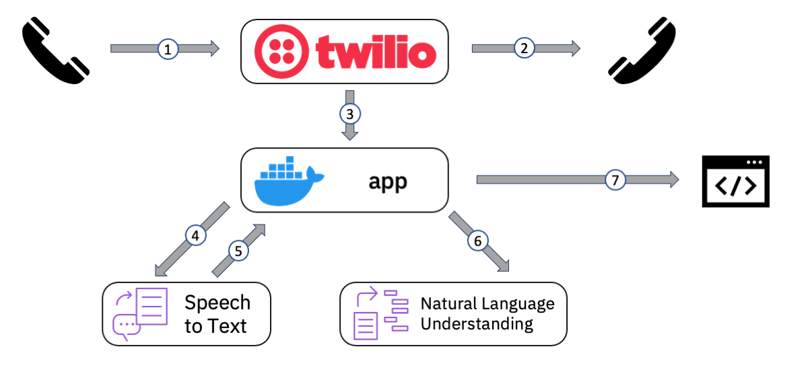
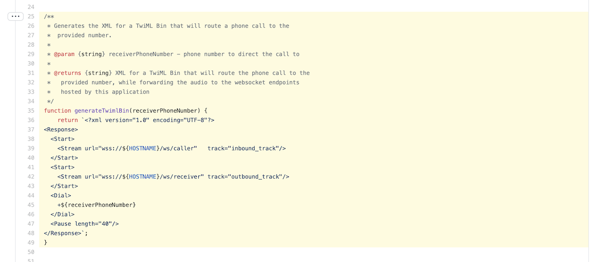
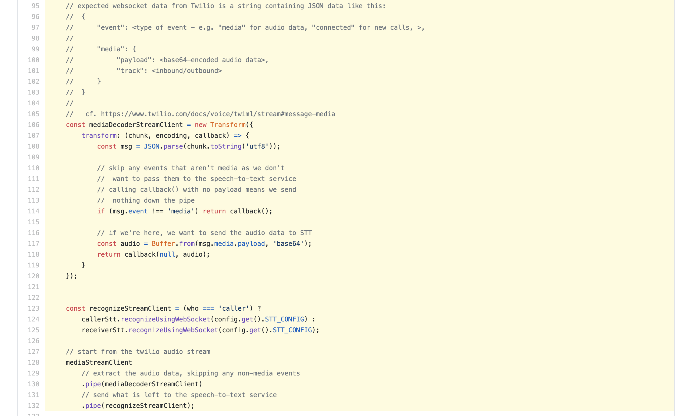

# Flow walkthrough

## (1) - Collecting the phone number to connect to

The caller dials a phone number managed by Twilio. This is the phone number that you buy and setup when you follow the [Twilio setup instructions](../twilio-setup/instructions.md).

The call processing is handled in two phases.

The first phase is implemented in TwiML Bin XML that is created as the final step of the [Twilio setup instructions](../twilio-setup/instructions.md).

The job of this code is to ask the caller to enter the phone number they want to call into their phone keypad.

Once the numbers are collected, the last thing this TwiML Bin code does is invoke a REST API defined in the `action` attribute.

## (2) - Connecting the call

The second phase of call handling is also implemented in TwiML Bin, but this is [dynamically generated by the invoked REST API](../lib/twilio.js) in the `generateTwimlBin` function.

It uses the `<Dial>` verb to connect the call to the receiver phone.

## (3) - Forwarding call audio to the application

The [generated TwiML Bin code](../lib/twilio.js) also includes two `<Stream>` verbs.

One instructs Twilio to stream the audio from the caller to the application's websocket address `/ws/caller`, that is defined in [`lib/api.js`](https://github.com/IBM/phone-stt-demo/blob/master/lib/api.js#L126).

The other instructs Twilio to stream the audio from the call receiver to the application's websocket address `/ws/receiver`, also defined in [`lib/api.js`](https://github.com/IBM/phone-stt-demo/blob/master/lib/api.js#L127).

This means that the application receives the two audio streams independently -  there is no need for the application to try and identify separate voices from a combined audio.

## (4) - Sending call audio to Speech to Text

Call audio is received as base64-encoded audio data in a [Twilio JSON payload format](https://www.twilio.com/docs/voice/twiml/stream#message-media).

[`lib/phone-to-stt.js`](https://github.com/IBM/phone-stt-demo/blob/master/lib/phone-to-stt.js#L92-L132) is responsible for extracting each base64-encoded audio string from the JSON objects, and sending them to the Watson Speech to Text service.

## (5) - Receiving transcriptions from Speech to Text

The Speech to Text service asynchronously sends transcriptions to the application when they are ready through a websocket connection.

The [configuration used for the Speech to Text service](../lib/config/stt.js) means that interim transcriptions are sent any time something is recognised, and final transcriptions are sent when the speaker pauses.

Transcriptions are received as JSON objects, and both interim and final transcriptions are processed by the `handleSttData()` function in [`lib/phone-to-stt.js`](https://github.com/IBM/phone-stt-demo/blob/master/lib/phone-to-stt.js#L149-L177).

These transcriptions are stored in-memory using [`lib/stt-store.js`](../lib/stt-store.js) so that they can be available for display in the web application (step 7).

## (6) - Analyzing transcriptions

When requested by the web application, a combined transcript of everything a caller has said on the call so far is submitted to the Watson Natural Language Understanding service for analysis. This is done by the [`analyze` function in `lib/nlu.js`](https://github.com/IBM/phone-stt-demo/blob/master/lib/nlu.js#L50-L97).

The [configuration used for the Natural Language Understanding service](../lib/config/nlu.js) means that emotion in the text is assessed (e.g. sadness, joy, fear, anger, etc.) however commented-out examples in [`NLU_CONFIG`](https://github.com/IBM/phone-stt-demo/blob/master/lib/config/nlu.js#L6-L43) show how other analyses such as tone or sentiment analysis could be performed.

As transcriptions can be received very frequently while someone is speaking, to avoid the application making a large number of calls to NLU, analyses are cached. The amount of time that a cached analysis should be reused is determined by the [`CACHE_TIME_SECONDS` constant](../lib/config/nlu.js).

