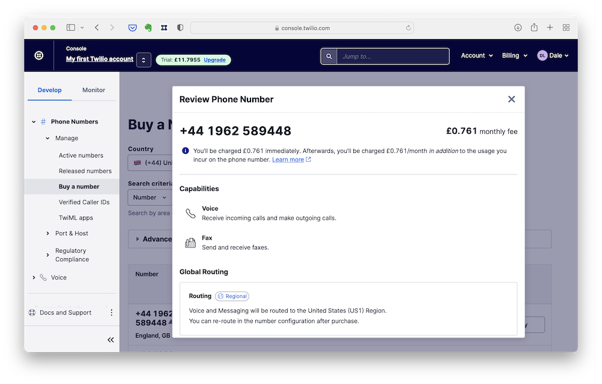
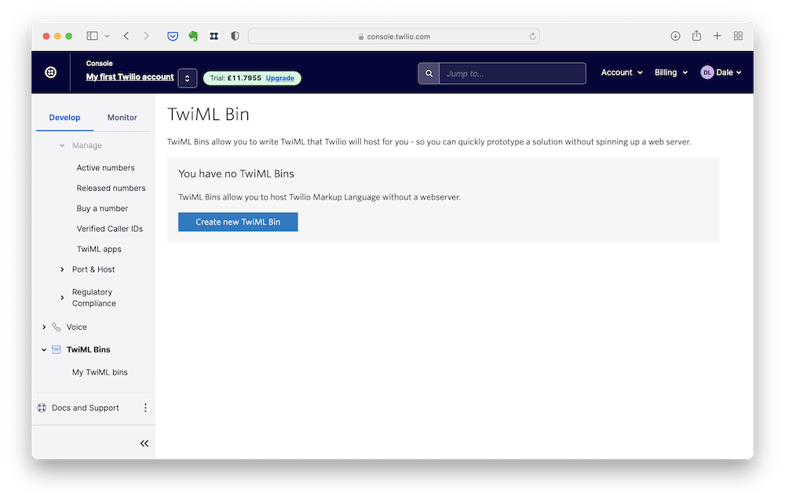
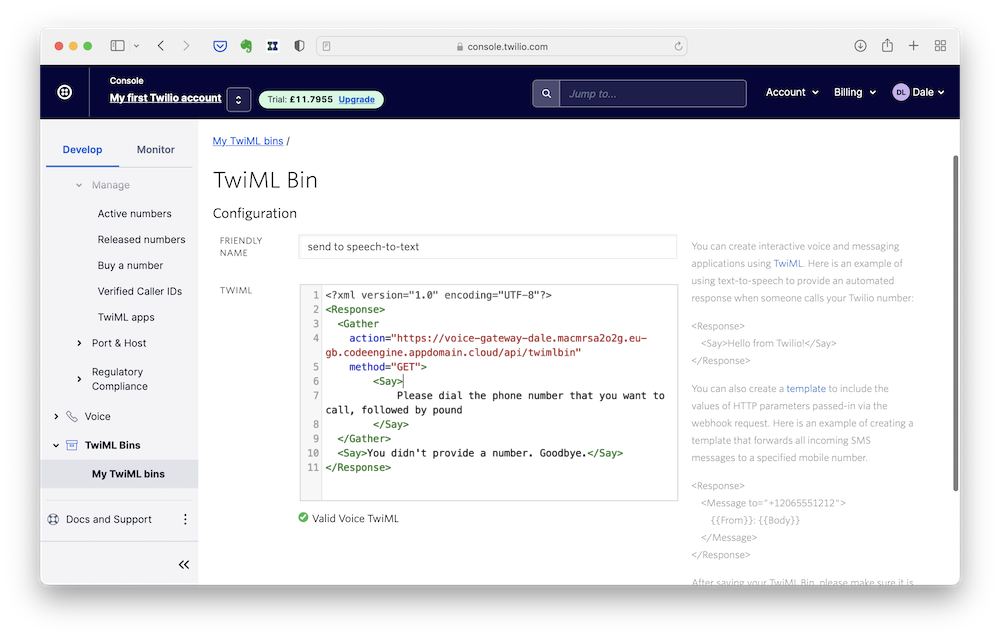

# Twilio instructions

There are four steps to setting up your phone number to work with your application.

- [Create an account](#create-an-account)
- [Buy a phone number](#buy-a-phone-number)
- [Set up call routing to your application](#set-up-the-call-routing)
- [Connect your phone number to the routing config](#connect-your-phone-number-to-the-routing)

---

## Create an account

You will need a Twilio account to run this app. The free trial will let you do everything that you need.

Go to https://www.twilio.com/try-twilio and start filling in the form to create an account.


You will need to verify your email address.


And you will need to verify a phone number.


The confirmation screen will ask what your plans are. The answers you give will change which shortcuts are added to the menus when you log in.

Everything will still be accessible whatever you choose, even if not added to the shortcuts menu.


Your account is ready to go.


---

## Buy a phone number
Navigate to the "Buy a Number" screen.


Choose a local phone number as this will save you money when you make test phone calls to it.


The charge for buying the phone number will come out of the credit you get with a new trial account.


You will need to accept some additional terms and conditions.


You will need to identify whether you will be making calls as a business or individual.


You need to assign an address to the new phone number. Click the "Create an address" link to open a new window.


In the new window, click the "Create an Address" button.


Fill in your address.


Once you have created the address, you can close this second window.


Back in the original window, the dialog for assigning an address to your new phone number should allow you to choose the address that you created.


Click the "Buy" button to confirm the purchase of the number. (The cost for this will be taken from your free trial credit)


---

## Set up the call routing

You need to find the TwiML Bin product. Start by clicking on "Explore Products".


Find "TwiML Bins". Clicking the "Pin to sidebar" button will make it easier to get back to this again later.


From the TwiML Bins screen, click the "Create new TwiML Bin" button.


The TwiML Bin screen gives you a place to give your function a name, and a window for describing the function in XML.


Here is a suggested configuration:
```xml
<?xml version="1.0" encoding="UTF-8"?>
<Response>
  <Gather
    action="REPLACE-THIS-URL/api/twimlbin"
    method="GET">
        <Say>
			Please dial the phone number that you want to call, followed by pound
        </Say>
  </Gather>
  <Say>You didn't provide a number. Goodbye.</Say>
</Response>
```

Replace `REPLACE-THIS-URL` with the URL for where you are running the application.



Click the "Save" button at the bottom of the page.

---

## Connect your phone number to the routing

Navigate back to the "Active Numbers" page.


Click through to the phone number that you created before.


Scroll down to the configuration options.
You need to configure it to:
- accept incoming voice calls
- configure with TwiML Bin
When a call comes in, choose the TwiML Bin that you created before.


You may need to accept additional terms and conditions at the bottom of this page.


You may need to add an emergency address. Click the "Add Emergency Address" button.


Click the "Select from my addresses" button.


You can now select the address you created before.


Click on the "Add Emergency Address" button to return to the call configuration.


Click the "Save" button to complete the configuration.

